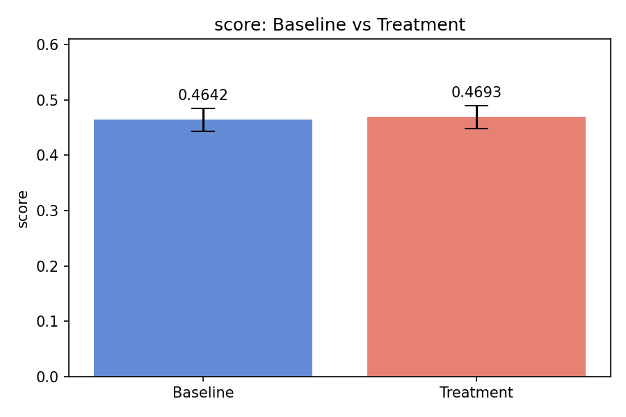

# Experiment Report: Applying lr_down, lr_up to the baseline will improve score.

## Introduction

This paper investigates the hypothesis: *Applying lr_down, lr_up to the baseline will improve score.*.

We apply the following modifications to the baseline: lr_down, lr_up.

## Method

We run a controlled experiment comparing baseline and treatment configurations
across 3 random seeds. The primary metric is **score**.

**Control:** baseline config (no changes)

**Treatment:** apply lr_down, lr_up

## Results

- Baseline: mean=0.4642, std=0.0206
- Treatment: mean=0.4693, std=0.0206
- Difference: +0.0051 (improvement)

The following figure summarizes the results:

| Group | Mean | Std | N |
|-------|------|-----|---|
| baseline | 0.4642 | 0.0206 | 3 |
| treatment | 0.4693 | 0.0206 | 3 |

## Limitations

- This is a toy experiment with a simplified scoring function.
- Only 3 seeds were used; more trials would increase confidence.
- The action space is restricted to predefined parameter changes.
- No statistical significance test was performed.

## Conclusion

The results support the hypothesis. The treatment configuration outperformed the baseline on the primary metric.

## References

- Experiment artifacts: `P20260225_154453/02_exp/runs/`
- Configuration: `P20260225_154453/01_plan/config.yaml`